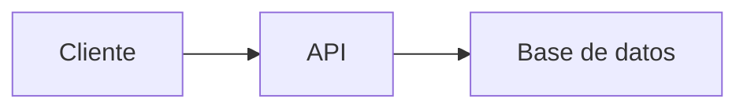

     # Estudio de Roles Básicos en Desarrollo Web y Móvil
## 0) Integrantes del equipo de estudio y sus responsabilidades en el repositorio
- Luis García lgarciada@unsa.edu.pe
- Richard Negron rnegron@unsa.edu.pe
- Valeria Ticona Nina vticonan@unsa.edu.pe (QA)
- Dayla Kyara Ticona Salgado dticonasa@unsa.edu.pe (QA)
## 1) Conceptos Generales para tener en cuenta
En el contexto de desarrollo web y móvil: diferencias entre librerías, frameworks y patrones de diseño.

## 2) Conociendo Git
Describiremos cómo nos sirve localmente para poder versionar nuestro software.

## 3) Conociendo Github  
- Describiendo el uso de repositorio remoto  
- Cómo definimos repositorio  
- Cómo configurar para permitir al equipo colaborar  
- Supervisión de posibles conflictos  

### Temas a desarrollar por los miembros del Equipo:  
Roles básicos en el desarrollo de aplicaciones web y aplicación móvil

## 4) Desarrollador Frontend *Cada uno complete lo que le corresponda*
- Descripción del rol: El desarrollo frontend se enfoca en la creación de la interfaz visual y la experiencia del usuario en una página web. Utiliza HTML, CSS y JS para construir páginas interactivas y responsivas. Su objetivo principal es garantizar que los usuarios puedan interactuar de forma intuitiva, rápida y eficiente con el sitio o aplicación. 
- Habilidades requeridas:
     - HTML/CSS: Maquetación y diseño de páginas web.
     - JavaScript: Interactividad y lógica del lado del cliente.
     - Frameworks: Desarrollo eficiente y estructurado.
     - Control de versiones (Git): Seguimiento y colaboración en código.
     - Diseño UI/UX básico: Crear interfaces amigables y atractivas.
- Relación con roles de Backend, QA, Desarrollador Android: El frontend se conecta con el backend mediante APIs para mostrar datos, y colabora con QA para asegurar calidad visual y funcional. También trabaja en paralelo con desarrolladores Android, creando interfaces similares en distintas plataformas.   
- Stack tecnológico:  
  - Lenguajes  
  - Frameworks   

## 5) Links recomendados para capacitación Rol Frontend *Cada uno complete lo que le corresponda*
🔹 Sin certificaciones:
     - developer.mozilla.org
     - www.w3schools.com
     - css-tricks.com
     - javascript.info
🔹 Con certificación:
     - www.freecodecamp.org
     - www.sololearn.com
     - learn.microsoft.com
     - www.coursera.org
🔹 Proyectos completos de ejemplo
🔹 Recomendadas por líderes (Microsoft, AWS, Google) 

## 6) Desarrollador Backend *Cada uno complete lo que le corresponda*
- Descripción del rol: El desarrollador backend se encarga de construir y mantener la lógica interna de una aplicación, gestionando bases de datos, servidores y APIs para garantizar que el sistema funcione correctamente y sea seguro.
- Habilidades requeridas:
   - Conocimiento de Lenguajes de Programación: Como Java, Python, Ruby, entre otros.
   - Medidas de seguridad: Para proteger datos y sistemas.
   - Integración con Frontend: Capacidad para integrar el backend con el frontend, a menudo utilizando tecnologías como HTML, CSS y JavaScript.
   - Comunicación: Ser efectiva tanto oral como escrita para colaborar con otros miembros.
   - Resolución de problemas: Capacidad para analizar, reconocer, resolver incidencias. 
   
- Relación con roles de Frontend, QA, Desarrollador Android:
   - Frontend: El frontend envia señales al backend, el backend procesa estas mismas y envia la información necesaria para que el frontend lo muestre en su interfaz.
   - QA: Estos dos roles mantienen  una estrecha comunicación para que el producto realizado satisfaga las necesidades del usuario. Probar la seguridad, bases de datos y el rendimiento, es fundamental.
   - Desarrollador Android: Trabajan en conjunto para crear aplicaciones funcionales. El backend se encarga de la lógica del servidor, bases de datos y APIs, mientras que el desarrollador Android diseña la interfaz y consume esos servicios
- Stack tecnológico:  
  - Lenguajes  
  - Frameworks 
  - Base de datos

## 7) Links recomendados para capacitación Rol Backend *Cada uno complete lo que le corresponda*
🔹 Sin certificaciones
  -https://scikit-learn.org/stable/# 
🔹 Con certificación  
  - https://www.codecademy.com/learn
  - https://cursa.app/en/free-course/back-end-ecgh?utm_source=chatgpt.com
  - https://www.oracle.com/mx/education/oracle-next-education/
  - https://www.oracle.com/mx/education/oracle-next-education/

🔹 Proyectos completos de ejemplo  
🔹 Recomendadas por líderes (Microsoft, AWS, Google)  
## 8) Rol QA *Cada uno complete lo que le corresponda*
- Descripción del rol: En las empresas tecnológicas, asegurar la calidad del software es tan importante como desarrollarlo. Aquí es donde entra el rol de QA (Quality Assurance).
El QA no solo detecta errores, sino que trabaja desde etapas tempranas del proyecto para prevenir fallos y garantizar que el producto funcione correctamente.
Este rol aporta valor al desarrollo al enfocarse en la funcionalidad, eficiencia y satisfacción del usuario, además de fortalecer la comunicación con otros equipos como frontend, backend y producto.
- Funciones:
     - Revisión: El QA analiza los requerimientos del sistema para detectar errores o ambigüedades desde el inicio del proyecto.
     - Pruebas: Diseña y ejecuta pruebas para asegurarse de que cada función del software opere correctamente.
     - Detección de errores: Identifica fallos en el sistema, los documenta y los comunica al equipo de desarrollo para que sean corregidos.
     - Validación final: Comprueba que los errores corregidos no hayan generado nuevos problemas y que el sistema esté listo para ser lanzado.
- Habilidades requeridas:
     - Habilidades Técnicas:
          - Conocimiento de metodologías de testing: Test cases, planes de prueba y estrategias de testing (manual y automatizado).
          - Fundamentos de software: Comprender los conceptos básicos del ciclo de vida del software (SDLC), tipos de testing.
          - Automatización de pruebas: Selenium, Cypress, JMeter, Appium, Postman, o similares para automatizar pruebas funcionales, de API y de carga.
          - Manejo de herramientas de gestión: Jira, TestRail, Zephyr, Quality Center para reportes de bugs, gestión de incidencias y seguimiento de pruebas.
          - Conocimientos de al menos un scripting/código: Python, Java, JavaScript, etc.
     - Habilidades Blandas:
          - Pensamiento analítico y crítico
          - Detallismo y precisión
          - Comunicación efectiva
- Relación con roles de Frontend, Backend, Desarrollador Android:
     - Frontend: QA prueba la interfaz que ve el usuario final: botones, formularios, menús, navegación, etc.
     - Backend: Devuelva respuestas correctas. Tenga buen manejo de errores. (Pruebas de API).
     - Android: Funcione en distintos dispositivos Android, resoluciones y versiones del sistema operativo. No tenga fallas al instalarse, abrirse o cerrarse.
- Stack tecnológico:  
  - Lenguajes  
  - Frameworks 

## 9) Links recomendados para capacitación Rol QA *Cada uno complete lo que le corresponda*
🔹 Sin certificaciones  

- Testing Al Grano – UPEX Galaxy (YouTube)
    > https://www.youtube.com/watch?v=Fv5ROH9D14o

🔹 Con certificación  

Nivel Principiante:
- Testea y Conecta: 20 dias de QA en Apps Descentralizadas.(Certificado de participación + POAP)
    > https://academiaqa.com/courses/20-dias-qa/ 
- Quality Assurance (QA) - Techniques and Methodologies
    > https://alison.com/course/quality-assurance-qa-techniques-and-methodologies (Certificación de pago)
- Curso de Tester de Software
    > https://edutin.com/curso-de-tester (Certificación de pago)

Nivel Intermedio:
- Best Quality Assurance Courses
    > https://alison.com/tag/quality-assurance (Certificación de pago)
- QA Process Optimization: Agile & Automated Testing
    > https://www.coursera.org/learn/qa-process-optimization-agile-automated-testing (Certificación de pago)
- Free Quality Assurance Bootcamp
    > https://www.codingtemple.com/free-courses/quality-assurance/

🔹 Proyectos completos de ejemplo  
🔹 Recomendadas por líderes (Microsoft, AWS, Google) 

## 8) Desarrollador Android *Cada uno complete lo que le corresponda*
- Descripción del rol:
- Habilidades requeridas:   
- Relación con roles de Frontend, Backend, QA:   
- Stack tecnológico:  
  - Lenguajes  
  - Frameworks 

## 9) Links recomendados para capacitación Rol Android *Cada uno complete lo que le corresponda*
🔹 Sin certificaciones  
🔹 Con certificación  
🔹 Proyectos completos de ejemplo  
🔹 Recomendadas por líderes (Microsoft, AWS, Google) 

## 12) Pasos a Desarrollar  
1. Luis García crea repositorio remoto: `RepositorioTrabajo`  
2. Compartir el repositorio con compañeros:  
   - Ir a Settings ⚙️ > Collaborators  
   - Invitar usando nombre de usuario GitHub o email registrado  
3. **Compañeros invitados**:  
   - Recibirán invitación por email  
   - Clonar repositorio:  
     ```bash
     cd practica
     git clone https://github.com/jjuarez29/EstudioRolesBasicos
     cd EstudioRolesBasicos
     ```
   - Ver contenido con `dir` (Windows) o `ls` (Linux/Mac)
ejemplo de link

## Conociendo algo de mermaid y markdown
**Mermaid** y **Markdown** son herramientas complementarias pero con propósitos diferentes. Aquí te explico sus diferencias y similitudes:

---

### 🔹 **Markdown** (`.md`)
Es un **lenguaje de marcado ligero** para formatear texto plano de manera sencilla, que se convierte en HTML.

**Características**:
1. **Sintaxis simple**: Usa símbolos como `#`, `*`, `>` para títulos, listas, citas, etc.
   ```markdown
   # Título
   - Lista
   **negrita**
   ```
2. **Propósito principal**: Documentación legible en repositorios (como `README.md`).
3. **Soporte nativo en GitHub/GitLab**: Se renderiza automáticamente.
4. **No es programable**: Solo estructura texto e imágenes.

---

### 🔹 **Mermaid**
Es una **librería de diagramación** que permite crear gráficos mediante código dentro de documentos Markdown.

**Características**:
1. **Sintaxis específica**: Usa bloques de código con la etiqueta `mermaid`.
   ````markdown
   ```mermaid
   graph TD
     A[Inicio] --> B{Decisión}
     B -->|Sí| C[OK]
     B -->|No| D[Error]
   ```
   ````
2. **Propósito principal**: Generar diagramas (flujos, UML, Gantt, etc.) sin herramientas externas.
3. **Requiere soporte**: Funciona en GitHub/GitLab con renderizadores compatibles (no en todos lados).
4. **Es programable**: Permite lógica para estructurar gráficos.

---

### 🔄 **Similitudes**
1. **Ambos usan texto plano**: Son legibles sin renderizar.
2. **Se integran en `.md`**: Mermaid vive dentro de bloques de código en Markdown.
3. **Uso en documentación**: Ideales para repositorios y wikis.

---

### 📌 **Diferencias clave**
| Característica       | Markdown                          | Mermaid                          |
|----------------------|-----------------------------------|----------------------------------|
| **Función**          | Formatear texto                   | Crear diagramas                  |
| **Sintaxis**         | `# Título`, `- lista`             | `graph TD`, `pie chart`          |
| **Renderizado**      | Soporte universal                 | Requiere compatibilidad          |
| **Ejemplo**          | Hacer listas o tablas             | Hacer flujogramas o secuencias   |

---

### 🛠 **Ejemplo combinado (Markdown + Mermaid)**
````markdown
# Documentación del Proyecto

## 📊 Diagrama de flujo


## 📝 Pasos
1. Ejecutar `npm install`
2. Abrir `index.html`
````

---

### ✅ **¿Cuándo usar cada uno?**
- **Usa Markdown** para:  
  READMEs, documentación, wikis, notas simples.  
- **Usa Mermaid** para:  
  Diagramas técnicos, arquitectura, flujos de trabajo.  

**Nota**: GitHub soporta ambos, pero verifica si tu plataforma (como Slack o GitLab) también renderiza Mermaid.
